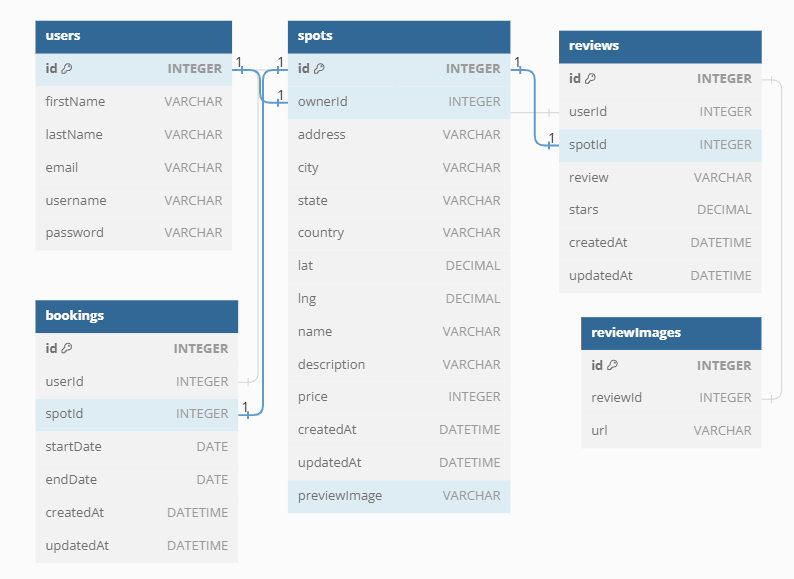

# Homegrown

Welcome to the new way to community garden. Hosted at [homegrown.onrender.com](homegrown.onrender.com), this application is modeled after popular nightly rental applications. Rather than pricing by night, a garden plot would be priced by season.

# Index

[Application Stack](#application-stack) | [Install Instructions](#install-instructions) | [Implementation Notes](#implementation-notes) | [Demonstration](#demonstration) | [Future Implementations](#future-implementations) | [Database Schema Design](#database-schema-design) | [API Documentation](#api-documentation)

## Application Stack

      

The backend of this project was first constructed before the frontend. The backend database framework used Sequelize so that SQLite could be used in development while PostGresQL is used in production. The backend router utilized the Express.js framework to create the RESTful API with Node.js.
The front end of this application was made using React/Redux with HTML, CSS, and JS. The Google Fonts API was also used to style text. The logo for the site was made in Canva.

## Install Instructions

If you wish to run this application locally, here are the install notes.

1. First you will need to clone this repository. <br> `git clone https://github.com/bssammel/homegrown.git`
2. Next you will need to navigate to the backend directory, then install Node. <br> `npm install`
3. You will also want to copy .env.example as a .env file, but with your key values. `cp .env.example .env`
4. Within this terminal and run either of these command groups:
   - Individual commands (must run in order): <br> `npx dotenv sequelize db:seed:undo:all` <br> `npx dotenv sequelize db:migrate:undo:all`<br> `npx dotenv sequelize db:migrate` <br> `npx dotenv sequelize db:seed:all`
   - You can also elect to run `npm run rebuild` as that is a custom script within package.json to run all of the above commands in order. This is found at line 14 in in `backend/package.json`.<br> `npm run rebuild`
5. While in the backend directory, you will start the application. <br> `npm run start`
6. Open a new terminal in the frontend directory so that the backend is live and install dependencies there.<br> `npm install`
7. In this frontend directory, then start the React frontend server.<br> `npm run dev`
8. In a new frontend directory, run `npm run build` which will trigger vite to build. The original command for this is `vite build --watch`. The `--watch` flag will trigger a rebuild when changes are made to vite.config.js as well as any bundled files. This is found at line 8 in `frontend/package.json`. <br> `npm run build`
9. If Vite does not automatically open a tab in your browser, navigate to `http://localhost:5173/`.
10. You are all set to run Homegrown on your local machine!

## Implementation Notes

This project did not come without its hurdles. As my first full-stack application, those hurdles also mean that it is not cleanest code. While there are plans to rewrite major portions of code in a V2, here are the parts I am proud of.

- Separating helper functions out from the file they are used in and importing those functions from the utils directory was a great step toward concise code and applying the single choice principle.
- Familiarizing myself with sequelize was certainly rough, but finally getting the correct implementation and syntax for the average rating of a spot was thrilling.
- When I was working on the logic for overlapping bookings I had to actually get a calendar out in front of my to sketch over and consider all the times. I hope to move this logic into its own util file in V2.
- Additionally, at any point when manipulating or comparing dates, I would write comments in at each step to avoid confusing which was the later date versus earlier dates.

## Demonstration

## Future Implementations

This is certainly a initial release that needs some refactoring done, but including and after that refactor, here are the planned improvements:

- 2.0.0 - This release will primarily be a major refactor of code to remove extraneous comments, console.logs, and other code used in debugging. This release will also include refactoring of the database fetches so that they are all uniform. This will also include some refactoring of the bodies sent from the backend. As part of bootcamp project, there were specific specifications that led to inconsistencies in objects delivered from the backend. The great majority of the work for this release will be in the backend.
- 2.1.0 - This release will be to include image edits on the Update Spot Form.
- 2.2.0 - Add latitude and longitude to Update and Create Spot forms. This will also include implementation of the Google Maps API to display a map in each Spot Detail page.
- 2.3.0 - Add bookings functionality so that users may book a garden plot.
- 2.4.0 - Manage Reviews Page.
- 2.5.0 - Allow garden plot owners to respond to reviews.
- ... And more to come.

## Database Schema Design



## API Documentation

## USER AUTHENTICATION/AUTHORIZATION

### All endpoints that require authentication

All endpoints that require a current user to be logged in.

- Request: endpoints that require authentication
- Error Response: Require authentication

  - Status Code: 401
  - Headers:
    - Content-Type: application/json
  - Body:

    ```json
    {
      "message": "Authentication required"
    }
    ```

### All endpoints that require proper authorization

All endpoints that require authentication and the current user does not have the
correct role(s) or permission(s).

- Request: endpoints that require proper authorization
- Error Response: Require proper authorization

  - Status Code: 403
  - Headers:
    - Content-Type: application/json
  - Body:

    ```json
    {
      "message": "Forbidden"
    }
    ```

### Get the Current User

Returns the information about the current user that is logged in.

- Require Authentication: true
- Request

  - Method: GET
  - URL: /api/session
  - Body: none

- Successful Response when there is a logged in user

  - Status Code: 200
  - Headers:
    - Content-Type: application/json
  - Body:

    ```json
    {
      "user": {
        "id": 1,
        "firstName": "John",
        "lastName": "Smith",
        "email": "john.smith@gmail.com",
        "username": "JohnSmith"
      }
    }
    ```

- Successful Response when there is no logged in user

  - Status Code: 200
  - Headers:
    - Content-Type: application/json
  - Body:

    ```json
    {
      "user": null
    }
    ```

### Log In a User

Logs in a current user with valid credentials and returns the current user's
information.

- Require Authentication: false
- Request

  - Method: POST
  - URL: /api/session
  - Headers:
    - Content-Type: application/json
  - Body:

    ```json
    {
      "credential": "john.smith@gmail.com",
      "password": "secret password"
    }
    ```

- Successful Response

  - Status Code: 200
  - Headers:
    - Content-Type: application/json
  - Body:

    ```json
    {
      "user": {
        "id": 1,
        "firstName": "John",
        "lastName": "Smith",
        "email": "john.smith@gmail.com",
        "username": "JohnSmith"
      }
    }
    ```

- Error Response: Invalid credentials

  - Status Code: 401
  - Headers:
    - Content-Type: application/json
  - Body:

    ```json
    {
      "message": "Invalid credentials"
    }
    ```

- Error response: Body validation errors

  - Status Code: 400
  - Headers:
    - Content-Type: application/json
  - Body:

    ```json
    {
      "message": "Bad Request", // (or "Validation error" if generated by Sequelize),
      "errors": {
        "credential": "Email or username is required",
        "password": "Password is required"
      }
    }
    ```

### Sign Up a User

Creates a new user, logs them in as the current user, and returns the current
user's information.

- Require Authentication: false
- Request

  - Method: POST
  - URL: /api/users
  - Headers:
    - Content-Type: application/json
  - Body:

    ```json
    {
      "firstName": "John",
      "lastName": "Smith",
      "email": "john.smith@gmail.com",
      "username": "JohnSmith",
      "password": "secret password"
    }
    ```

- Successful Response

  - Status Code: 200
  - Headers:
    - Content-Type: application/json
  - Body:

    ```json
    {
      "user": {
        "id": 1,
        "firstName": "John",
        "lastName": "Smith",
        "email": "john.smith@gmail.com",
        "username": "JohnSmith"
      }
    }
    ```

- Error response: User already exists with the specified email

  - Status Code: 500
  - Headers:
    - Content-Type: application/json
  - Body:

    ```json
    {
      "message": "User already exists",
      "errors": {
        "email": "User with that email already exists"
      }
    }
    ```

- Error response: User already exists with the specified username

  - Status Code: 500
  - Headers:
    - Content-Type: application/json
  - Body:

    ```json
    {
      "message": "User already exists",
      "errors": {
        "username": "User with that username already exists"
      }
    }
    ```

- Error response: Body validation errors

  - Status Code: 400
  - Headers:
    - Content-Type: application/json
  - Body:

    ```json
    {
      "message": "Bad Request", // (or "Validation error" if generated by Sequelize),
      "errors": {
        "email": "Invalid email",
        "username": "Username is required",
        "firstName": "First Name is required",
        "lastName": "Last Name is required"
      }
    }
    ```

## SPOTS

### Get all Spots

Returns all the spots.

- Require Authentication: false
- Request

  - Method: GET
  - URL: /api/spots
  - Body: none

- Successful Response

  - Status Code: 200
  - Headers:
    - Content-Type: application/json
  - Body:

    ```json
    {
      "Spots": [
        {
          "id": 1,
          "ownerId": 1,
          "address": "123 Disney Lane",
          "city": "San Francisco",
          "state": "California",
          "country": "United States of America",
          "lat": 37.7645358,
          "lng": -122.4730327,
          "name": "App Academy",
          "description": "Place where web developers are created",
          "price": 123,
          "createdAt": "2021-11-19 20:39:36",
          "updatedAt": "2021-11-19 20:39:36",
          "avgRating": 4.5,
          "previewImage": "image url"
        }
      ]
    }
    ```

### Get all Spots owned by the Current User

Returns all the spots owned (created) by the current user.

- Require Authentication: true
- Request

  - Method: GET
  - URL: /api/spots/current
  - Body: none

- Successful Response

  - Status Code: 200
  - Headers:
    - Content-Type: application/json
  - Body:

    ```json
    {
      "Spots": [
        {
          "id": 1,
          "ownerId": 1,
          "address": "123 Disney Lane",
          "city": "San Francisco",
          "state": "California",
          "country": "United States of America",
          "lat": 37.7645358,
          "lng": -122.4730327,
          "name": "App Academy",
          "description": "Place where web developers are created",
          "price": 123,
          "createdAt": "2021-11-19 20:39:36",
          "updatedAt": "2021-11-19 20:39:36",
          "avgRating": 4.5,
          "previewImage": "image url"
        }
      ]
    }
    ```

### Get details of a Spot from an id

Returns the details of a spot specified by its id.

- Require Authentication: false
- Request

  - Method: GET
  - URL: /api/spots/:spotId
  - Body: none

- Successful Response

  - Status Code: 200
  - Headers:
    - Content-Type: application/json
  - Body:

    ```json
    {
      "id": 1,
      "ownerId": 1,
      "address": "123 Disney Lane",
      "city": "San Francisco",
      "state": "California",
      "country": "United States of America",
      "lat": 37.7645358,
      "lng": -122.4730327,
      "name": "App Academy",
      "description": "Place where web developers are created",
      "price": 123,
      "createdAt": "2021-11-19 20:39:36",
      "updatedAt": "2021-11-19 20:39:36",
      "numReviews": 5,
      "avgStarRating": 4.5,
      "SpotImages": [
        {
          "id": 1,
          "url": "image url",
          "preview": true
        },
        {
          "id": 2,
          "url": "image url",
          "preview": false
        }
      ],
      "Owner": {
        "id": 1,
        "firstName": "John",
        "lastName": "Smith"
      }
    }
    ```

- Error response: Couldn't find a Spot with the specified id

  - Status Code: 404
  - Headers:
    - Content-Type: application/json
  - Body:

    ```json
    {
      "message": "Spot couldn't be found"
    }
    ```

### Create a Spot

Creates and returns a new spot.

- Require Authentication: true
- Request

  - Method: POST
  - URL: /api/spots
  - Headers:
    - Content-Type: application/json
  - Body:

    ```json
    {
      "address": "123 Disney Lane",
      "city": "San Francisco",
      "state": "California",
      "country": "United States of America",
      "lat": 37.7645358,
      "lng": -122.4730327,
      "name": "App Academy",
      "description": "Place where web developers are created",
      "price": 123
    }
    ```

- Successful Response

  - Status Code: 201
  - Headers:
    - Content-Type: application/json
  - Body:

    ```json
    {
      "id": 1,
      "ownerId": 1,
      "address": "123 Disney Lane",
      "city": "San Francisco",
      "state": "California",
      "country": "United States of America",
      "lat": 37.7645358,
      "lng": -122.4730327,
      "name": "App Academy",
      "description": "Place where web developers are created",
      "price": 123,
      "createdAt": "2021-11-19 20:39:36",
      "updatedAt": "2021-11-19 20:39:36"
    }
    ```

- Error Response: Body validation error

  - Status Code: 400
  - Headers:
    - Content-Type: application/json
  - Body:

    ```json
    {
      "message": "Bad Request", // (or "Validation error" if generated by Sequelize),
      "errors": {
        "address": "Street address is required",
        "city": "City is required",
        "state": "State is required",
        "country": "Country is required",
        "lat": "Latitude is not valid",
        "lng": "Longitude is not valid",
        "name": "Name must be less than 50 characters",
        "description": "Description is required",
        "price": "Price per day is required"
      }
    }
    ```

### Add an Image to a Spot based on the Spot's id

Create and return a new image for a spot specified by id.

- Require Authentication: true
- Require proper authorization: Spot must belong to the current user
- Request

  - Method: POST
  - URL: /api/spots/:spotId/images
  - Headers:
    - Content-Type: application/json
  - Body:

    ```json
    {
      "url": "image url",
      "preview": true
    }
    ```

- Successful Response

  - Status Code: 200
  - Headers:
    - Content-Type: application/json
  - Body:

    ```json
    {
      "id": 1,
      "url": "image url",
      "preview": true
    }
    ```

- Error response: Couldn't find a Spot with the specified id

  - Status Code: 404
  - Headers:
    - Content-Type: application/json
  - Body:

    ```json
    {
      "message": "Spot couldn't be found"
    }
    ```

### Edit a Spot

Updates and returns an existing spot.

- Require Authentication: true
- Require proper authorization: Spot must belong to the current user
- Request

  - Method: POST
  - URL: /api/spots/:spotId
  - Headers:
    - Content-Type: application/json
  - Body:

    ```json
    {
      "address": "123 Disney Lane",
      "city": "San Francisco",
      "state": "California",
      "country": "United States of America",
      "lat": 37.7645358,
      "lng": -122.4730327,
      "name": "App Academy",
      "description": "Place where web developers are created",
      "price": 123
    }
    ```

- Successful Response

  - Status Code: 200
  - Headers:
    - Content-Type: application/json
  - Body:

    ```json
    {
      "id": 1,
      "ownerId": 1,
      "address": "123 Disney Lane",
      "city": "San Francisco",
      "state": "California",
      "country": "United States of America",
      "lat": 37.7645358,
      "lng": -122.4730327,
      "name": "App Academy",
      "description": "Place where web developers are created",
      "price": 123,
      "createdAt": "2021-11-19 20:39:36",
      "updatedAt": "2021-11-20 10:06:40"
    }
    ```

- Error Response: Body validation error

  - Status Code: 400
  - Headers:
    - Content-Type: application/json
  - Body:

    ```json
    {
      "message": "Bad Request", // (or "Validation error" if generated by Sequelize),
      "errors": {
        "address": "Street address is required",
        "city": "City is required",
        "state": "State is required",
        "country": "Country is required",
        "lat": "Latitude is not valid",
        "lng": "Longitude is not valid",
        "name": "Name must be less than 50 characters",
        "description": "Description is required",
        "price": "Price per day is required"
      }
    }
    ```

- Error response: Couldn't find a Spot with the specified id

  - Status Code: 404
  - Headers:
    - Content-Type: application/json
  - Body:

    ```json
    {
      "message": "Spot couldn't be found"
    }
    ```

### Delete a Spot

Deletes an existing spot.

- Require Authentication: true
- Require proper authorization: Spot must belong to the current user
- Request

  - Method: POST
  - URL: /api/spots/:spotId
  - Body: none

- Successful Response

  - Status Code: 200
  - Headers:
    - Content-Type: application/json
  - Body:

    ```json
    {
      "message": "Successfully deleted"
    }
    ```

- Error response: Couldn't find a Spot with the specified id

  - Status Code: 404
  - Headers:
    - Content-Type: application/json
  - Body:

    ```json
    {
      "message": "Spot couldn't be found"
    }
    ```

## REVIEWS

### Get all Reviews of the Current User

Returns all the reviews written by the current user.

- Require Authentication: true
- Request

  - Method: GET
  - URL: /api/reviews/current
  - Body: none

- Successful Response

  - Status Code: 200
  - Headers:
    - Content-Type: application/json
  - Body:

    ```json
    {
      "Reviews": [
        {
          "id": 1,
          "userId": 1,
          "spotId": 1,
          "review": "This was an awesome spot!",
          "stars": 5,
          "createdAt": "2021-11-19 20:39:36",
          "updatedAt": "2021-11-19 20:39:36",
          "User": {
            "id": 1,
            "firstName": "John",
            "lastName": "Smith"
          },
          "Spot": {
            "id": 1,
            "ownerId": 1,
            "address": "123 Disney Lane",
            "city": "San Francisco",
            "state": "California",
            "country": "United States of America",
            "lat": 37.7645358,
            "lng": -122.4730327,
            "name": "App Academy",
            "price": 123,
            "previewImage": "image url"
          },
          "ReviewImages": [
            {
              "id": 1,
              "url": "image url"
            }
          ]
        }
      ]
    }
    ```

### Get all Reviews by a Spot's id

Returns all the reviews that belong to a spot specified by id.

- Require Authentication: false
- Request

  - Method: GET
  - URL: /api/spots/:spotId/reviews
  - Body: none

- Successful Response

  - Status Code: 200
  - Headers:
    - Content-Type: application/json
  - Body:

    ```json
    {
      "Reviews": [
        {
          "id": 1,
          "userId": 1,
          "spotId": 1,
          "review": "This was an awesome spot!",
          "stars": 5,
          "createdAt": "2021-11-19 20:39:36",
          "updatedAt": "2021-11-19 20:39:36",
          "User": {
            "id": 1,
            "firstName": "John",
            "lastName": "Smith"
          },
          "ReviewImages": [
            {
              "id": 1,
              "url": "image url"
            }
          ]
        }
      ]
    }
    ```

- Error response: Couldn't find a Spot with the specified id

  - Status Code: 404
  - Headers:
    - Content-Type: application/json
  - Body:

    ```json
    {
      "message": "Spot couldn't be found"
    }
    ```

### Create a Review for a Spot based on the Spot's id

Create and return a new review for a spot specified by id.

- Require Authentication: true
- Request

  - Method: POST
  - URL: /api/spots/:spotId/reviews
  - Headers:
    - Content-Type: application/json
  - Body:

    ```json
    {
      "review": "This was an awesome spot!",
      "stars": 5
    }
    ```

- Successful Response

  - Status Code: 201
  - Headers:
    - Content-Type: application/json
  - Body:

    ```json
    {
      "id": 1,
      "userId": 1,
      "spotId": 1,
      "review": "This was an awesome spot!",
      "stars": 5,
      "createdAt": "2021-11-19 20:39:36",
      "updatedAt": "2021-11-19 20:39:36"
    }
    ```

- Error Response: Body validation errors

  - Status Code: 400
  - Headers:
    - Content-Type: application/json
  - Body:

    ```json
    {
      "message": "Bad Request", // (or "Validation error" if generated by Sequelize),
      "errors": {
        "review": "Review text is required",
        "stars": "Stars must be an integer from 1 to 5"
      }
    }
    ```

- Error response: Couldn't find a Spot with the specified id

  - Status Code: 404
  - Headers:
    - Content-Type: application/json
  - Body:

    ```json
    {
      "message": "Spot couldn't be found"
    }
    ```

- Error response: Review from the current user already exists for the Spot

  - Status Code: 500
  - Headers:
    - Content-Type: application/json
  - Body:

    ```json
    {
      "message": "User already has a review for this spot"
    }
    ```

### Add an Image to a Review based on the Review's id

Create and return a new image for a review specified by id.

- Require Authentication: true
- Require proper authorization: Review must belong to the current user
- Request

  - Method: POST
  - URL: /api/reviews/:reviewId/images
  - Headers:
    - Content-Type: application/json
  - Body:

    ```json
    {
      "url": "image url"
    }
    ```

- Successful Response

  - Status Code: 200
  - Headers:
    - Content-Type: application/json
  - Body:

    ```json
    {
      "id": 1,
      "url": "image url"
    }
    ```

- Error response: Couldn't find a Review with the specified id

  - Status Code: 404
  - Headers:
    - Content-Type: application/json
  - Body:

    ```json
    {
      "message": "Review couldn't be found"
    }
    ```

- Error response: Cannot add any more images because there is a maximum of 10
  images per resource

  - Status Code: 403
  - Headers:
    - Content-Type: application/json
  - Body:

    ```json
    {
      "message": "Maximum number of images for this resource was reached"
    }
    ```

### Edit a Review

Update and return an existing review.

- Require Authentication: true
- Require proper authorization: Review must belong to the current user
- Request

  - Method: PUT
  - URL: /api/reviews/:reviewId/
  - Headers:
    - Content-Type: application/json
  - Body:

    ```json
    {
      "review": "This was an awesome spot!",
      "stars": 5
    }
    ```

- Successful Response

  - Status Code: 200
  - Headers:
    - Content-Type: application/json
  - Body:

    ```json
    {
      "id": 1,
      "userId": 1,
      "spotId": 1,
      "review": "This was an awesome spot!",
      "stars": 5,
      "createdAt": "2021-11-19 20:39:36",
      "updatedAt": "2021-11-20 10:06:40"
    }
    ```

- Error Response: Body validation errors

  - Status Code: 400
  - Headers:
    - Content-Type: application/json
  - Body:

    ```json
    {
      "message": "Bad Request", // (or "Validation error" if generated by Sequelize),
      "errors": {
        "review": "Review text is required",
        "stars": "Stars must be an integer from 1 to 5"
      }
    }
    ```

- Error response: Couldn't find a Review with the specified id

  - Status Code: 404
  - Headers:
    - Content-Type: application/json
  - Body:

    ```json
    {
      "message": "Review couldn't be found"
    }
    ```

### Delete a Review

Delete an existing review.

- Require Authentication: true
- Require proper authorization: Review must belong to the current user
- Request

  - Method: DELETE
  - URL: /api/reviews/:reviewId/
  - Body: none

- Successful Response

  - Status Code: 200
  - Headers:
    - Content-Type: application/json
  - Body:

    ```json
    {
      "message": "Successfully deleted"
    }
    ```

- Error response: Couldn't find a Review with the specified id

  - Status Code: 404
  - Headers:
    - Content-Type: application/json
  - Body:

    ```json
    {
      "message": "Review couldn't be found"
    }
    ```

## BOOKINGS

### Get all of the Current User's Bookings

Return all the bookings that the current user has made.

- Require Authentication: true
- Request

  - Method: GET
  - URL: /api/bookings/current
  - Body: none

- Successful Response

  - Status Code: 200
  - Headers:
    - Content-Type: application/json
  - Body:

    ```json
    {
      "Bookings": [
        {
          "id": 1,
          "spotId": 1,
          "Spot": {
            "id": 1,
            "ownerId": 1,
            "address": "123 Disney Lane",
            "city": "San Francisco",
            "state": "California",
            "country": "United States of America",
            "lat": 37.7645358,
            "lng": -122.4730327,
            "name": "App Academy",
            "price": 123,
            "previewImage": "image url"
          },
          "userId": 2,
          "startDate": "2021-11-19",
          "endDate": "2021-11-20",
          "createdAt": "2021-11-19 20:39:36",
          "updatedAt": "2021-11-19 20:39:36"
        }
      ]
    }
    ```

### Get all Bookings for a Spot based on the Spot's id

Return all the bookings for a spot specified by id.

- Require Authentication: true
- Request

  - Method: GET
  - URL: /api/spots/:spotId/bookings
  - Body: none

- Successful Response: If you ARE NOT the owner of the spot.

  - Status Code: 200
  - Headers:
    - Content-Type: application/json
  - Body:

    ```json
    {
      "Bookings": [
        {
          "spotId": 1,
          "startDate": "2021-11-19",
          "endDate": "2021-11-20"
        }
      ]
    }
    ```

- Successful Response: If you ARE the owner of the spot.

  - Status Code: 200
  - Headers:
    - Content-Type: application/json
  - Body:

    ```json
    {
      "Bookings": [
        {
          "User": {
            "id": 2,
            "firstName": "John",
            "lastName": "Smith"
          },
          "id": 1,
          "spotId": 1,
          "userId": 2,
          "startDate": "2021-11-19",
          "endDate": "2021-11-20",
          "createdAt": "2021-11-19 20:39:36",
          "updatedAt": "2021-11-19 20:39:36"
        }
      ]
    }
    ```

- Error response: Couldn't find a Spot with the specified id

  - Status Code: 404
  - Headers:
    - Content-Type: application/json
  - Body:

    ```json
    {
      "message": "Spot couldn't be found"
    }
    ```

### Create a Booking from a Spot based on the Spot's id

Create and return a new booking from a spot specified by id.

- Require Authentication: true
- Require proper authorization: Spot must NOT belong to the current user
- Request

  - Method: POST
  - URL: /api/spots/:spotId/bookings
  - Body:

    ```json
    {
      "startDate": "2021-11-19",
      "endDate": "2021-11-20"
    }
    ```

- Successful Response

  - Status Code: 200
  - Headers:
    - Content-Type: application/json
  - Body:

    ```json
    {
      "id": 1,
      "spotId": 1,
      "userId": 2,
      "startDate": "2021-11-19",
      "endDate": "2021-11-20",
      "createdAt": "2021-11-19 20:39:36",
      "updatedAt": "2021-11-19 20:39:36"
    }
    ```

- Error response: Body validation errors

  - Status Code: 400
  - Headers:
    - Content-Type: application/json
  - Body:

    ```json
    {
      "message": "Bad Request", // (or "Validation error" if generated by Sequelize),
      "errors": {
        "endDate": "endDate cannot be on or before startDate"
      }
    }
    ```

- Error response: Couldn't find a Spot with the specified id

  - Status Code: 404
  - Headers:
    - Content-Type: application/json
  - Body:

    ```json
    {
      "message": "Spot couldn't be found"
    }
    ```

- Error response: Booking conflict

  - Status Code: 403
  - Headers:
    - Content-Type: application/json
  - Body:

    ```json
    {
      "message": "Sorry, this spot is already booked for the specified dates",
      "errors": {
        "startDate": "Start date conflicts with an existing booking",
        "endDate": "End date conflicts with an existing booking"
      }
    }
    ```

### Edit a Booking

Update and return an existing booking.

- Require Authentication: true
- Require proper authorization: Booking must belong to the current user
- Request

  - Method: PUT
  - URL: /api/bookings/:bookingId
  - Headers:
    - Content-Type: application/json
  - Body:

    ```json
    {
      "startDate": "2021-11-19",
      "endDate": "2021-11-20"
    }
    ```

- Successful Response

  - Status Code: 200
  - Headers:
    - Content-Type: application/json
  - Body:

    ```json
    {
      "id": 1,
      "spotId": 1,
      "userId": 2,
      "startDate": "2021-11-19",
      "endDate": "2021-11-20",
      "createdAt": "2021-11-19 20:39:36",
      "updatedAt": "2021-11-20 10:06:40"
    }
    ```

- Error response: Body validation errors

  - Status Code: 400
  - Headers:
    - Content-Type: application/json
  - Body:

    ```json
    {
      "message": "Bad Request", // (or "Validation error" if generated by Sequelize),
      "errors": {
        "endDate": "endDate cannot come before startDate"
      }
    }
    ```

- Error response: Couldn't find a Booking with the specified id

  - Status Code: 404
  - Headers:
    - Content-Type: application/json
  - Body:

    ```json
    {
      "message": "Booking couldn't be found"
    }
    ```

- Error response: Can't edit a booking that's past the end date

  - Status Code: 403
  - Headers:
    - Content-Type: application/json
  - Body:

    ```json
    {
      "message": "Past bookings can't be modified"
    }
    ```

- Error response: Booking conflict

  - Status Code: 403
  - Headers:
    - Content-Type: application/json
  - Body:

    ```json
    {
      "message": "Sorry, this spot is already booked for the specified dates",
      "errors": {
        "startDate": "Start date conflicts with an existing booking",
        "endDate": "End date conflicts with an existing booking"
      }
    }
    ```

### Delete a Booking

Delete an existing booking.

- Require Authentication: true
- Require proper authorization: Booking must belong to the current user or the
  Spot must belong to the current user
- Request

  - Method: DELETE
  - URL: /api/bookings/:bookingId
  - Body: none

- Successful Response

  - Status Code: 200
  - Headers:
    - Content-Type: application/json
  - Body:

    ```json
    {
      "message": "Successfully deleted"
    }
    ```

- Error response: Couldn't find a Booking with the specified id

  - Status Code: 404
  - Headers:
    - Content-Type: application/json
  - Body:

    ```json
    {
      "message": "Booking couldn't be found"
    }
    ```

- Error response: Bookings that have been started can't be deleted

  - Status Code: 403
  - Headers:
    - Content-Type: application/json
  - Body:

    ```json
    {
      "message": "Bookings that have been started can't be deleted"
    }
    ```

## IMAGES

### Delete a Spot Image

Delete an existing image for a Spot.

- Require Authentication: true
- Require proper authorization: Spot must belong to the current user
- Request

  - Method: DELETE
  - URL: /api/spots/:spotId/images/:imageId
  - Body: none

- Successful Response

  - Status Code: 200
  - Headers:
    - Content-Type: application/json
  - Body:

    ```json
    {
      "message": "Successfully deleted"
    }
    ```

- Error response: Couldn't find a Spot Image with the specified id

  - Status Code: 404
  - Headers:
    - Content-Type: application/json
  - Body:

    ```json
    {
      "message": "Spot Image couldn't be found"
    }
    ```

### Delete a Review Image

Delete an existing image for a Review.

- Require Authentication: true
- Require proper authorization: Review must belong to the current user
- Request

  - Method: DELETE
  - URL: /api/reviews/:reviewId/images/:imageId
  - Body: none

- Successful Response

  - Status Code: 200
  - Headers:
    - Content-Type: application/json
  - Body:

    ```json
    {
      "message": "Successfully deleted"
    }
    ```

- Error response: Couldn't find a Review Image with the specified id

  - Status Code: 404
  - Headers:
    - Content-Type: application/json
  - Body:

    ```json
    {
      "message": "Review Image couldn't be found"
    }
    ```

## Add Query Filters to Get All Spots

Return spots filtered by query parameters.

- Require Authentication: false
- Request

  - Method: GET
  - URL: /api/spots/ ((felt like I was either way overthinking this one or way under))
  - Query Parameters
    - page: integer, minimum: 1, maximum: 10, default: 1
    - size: integer, minimum: 1, maximum: 20, default: 20
    - minLat: decimal, optional
    - maxLat: decimal, optional
    - minLng: decimal, optional
    - maxLng: decimal, optional
    - minPrice: decimal, optional, minimum: 0
    - maxPrice: decimal, optional, minimum: 0
  - Body: none

- Successful Response

  - Status Code: 200
  - Headers:
    - Content-Type: application/json
  - Body:

    ```json
    {
      "Spots": [
        {
          "id": 1,
          "ownerId": 1,
          "address": "123 Disney Lane",
          "city": "San Francisco",
          "state": "California",
          "country": "United States of America",
          "lat": 37.7645358,
          "lng": -122.4730327,
          "name": "App Academy",
          "description": "Place where web developers are created",
          "price": 123,
          "createdAt": "2021-11-19 20:39:36",
          "updatedAt": "2021-11-19 20:39:36",
          "avgRating": 4.5,
          "previewImage": "image url"
        }
      ],
      "page": 2,
      "size": 25
    }
    ```

- Error Response: Query parameter validation errors

  - Status Code: 400
  - Headers:
    - Content-Type: application/json
  - Body:

    ```json
    {
      "message": "Bad Request", // (or "Validation error" if generated by Sequelize),
      "errors": {
        "page": "Page must be greater than or equal to 1",
        "size": "Size must be greater than or equal to 1",
        "maxLat": "Maximum latitude is invalid",
        "minLat": "Minimum latitude is invalid",
        "minLng": "Maximum longitude is invalid",
        "maxLng": "Minimum longitude is invalid",
        "minPrice": "Minimum price must be greater than or equal to 0",
        "maxPrice": "Maximum price must be greater than or equal to 0"
      }
    }
    ```
